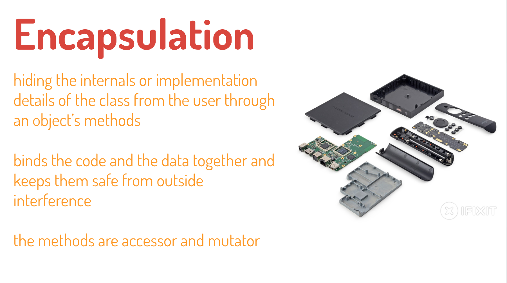

# OOP Characteristics

According to the Object Oriented programming language, it has to allow working with classes and objects as well as the implementation and use of the main four fundamental object oriented principles and concepts.

1. `Abstraction` = Deal with objects since their important features and ignore all other details.
2. `Encapsulation` = Hide unnecessary details in classes and deliver a simple and clear interface for working.
3. `Inheritance` = explain how the class hierarchies develop code readability and support to the reuse of functionality.
4. `Polymorphism` = explain how to work with different object in the same manner, which explain the specific implementation of some abstract behavior.

### Abstraction

Abstraction is a concept which facilitates to extract out the essential information of an object. Abstraction facilitates the easy conceptualization of real world objects, by eliminating the unnecessary details of the object. Unnecessary details? Yes, all the similar objects when you generalize, you will drop the uncommon details about the objects.


> For example, the remote TV in real life, we only know how to turn on / turn off the TV by pressing the power button but we don't know what process executed inside the remote when we pressing the power button.

### Encapsulation

The process, or mechanism, by which you combine code and the data it manipulates into a single unit, is commonly referred to as encapsulation. Encapsulation provides a layer of security around manipulated data, protecting it from external interference and misuse. 

There are 3 privilege types of properties = 

- `public` = properties can be accessed outside the class.
- `private` = properties can only be accessed inside the class.

- `protected` = properties can only be accessed inside the class and its child.

Private properties can be declared by adding `underscore (_)` keyword in front of each private property. In order to access or manipulate the private properties, we can use `getter` (accessor) and `setter` (mutator).

- The **get** syntax binds an object property to a function that will be called when that property is looked up. `Getter` usually `return` some values which is the value of the private properties or any logical process inside `getter`.
- The **set** syntax binds an object property to a function to be called when there is an attempt to set that property. `Setter` usually has an assignment process and received only `one parameter` to change the value of the private property.

Unlike instance method, both `getter` and `setter` is treated like property so we don't need to invoke them.

```javascript
class Person {
  constructor (firstName, lastName) {
    this._firstName = firstName;    // private property
    this.lastName = lastName;	    // public property
  }
  
  // Getter to access value of firstName
  get firstName() {
    return this._firstName;
  }
  
  // Setter to change value of firstName
  set firstName(value) {
    this._firstName = value;
  }
}

const arya = new Person ("Arya", "Stark");
console.log(arya);	        // Output : Person { _firstName: "Arya", lastName: "Stark" }

// Using setter just like assigning the property
arya.firstName = "Robb"; 	// This will change the value of this._firstName

// Using getter just like accessing the property
console.log(arya.firstName); 	// Output : "Robb"
```



> In Javascript, this **`layer of security is not fully supported`** since you still can access the `private properties` outside the class.

### Inheritance

New data types (classes) can be defined as extensions to previously defined types =

- `Parent Class` (Super Class)
- `Child Class` (Sub Class) that inherits all properties and methods from the parent class.

This allows classes to be arranged in a hierarchy that represents "is-a-type-of" relationships. We can use inheritance if all the data and methods available to the parent class also appear in the child class with the same names. This technique allows easy re-use of the same procedures and data definitions, in addition to potentially mirroring real-world relationships in an intuitive way. 

Unlike other programming language that supports `multiple inheritance` , in Javascript, only support `single inheritance` which there is only one parent class is allowed.

To apply inheritance in child class just add `extends` keyword followed by `parent class` name. Therefore, in child's constructor must be `super()` keyword which will invoke the parent's constructor. If the parent's constructor have two parameters, so that the `super()` inside the child's constructor also must have two parameters. If there is another property that only the child class has, we can add it after `super()`.

We don't need to redeclare all methods that already been declared in parent class, unless we want to override it or there are additional instance methods that only the child class has.

```javascript
// Parent Class
class Car {
  constructor (model, price) {
    this._model = model;
    this._price = price;
  }

  get price() {
    return this._price;
  }

  brush(color) {
    console.log(`${this._model} color is ${color}.`);
  }
}

// Child Class (Toyota) inherits Parent Class (Car)
class Toyota extends Car {
  constructor (model, price, cc) {
    super (model, price);	// This will invoke the constructor in parent class
    this._cc = cc;	        // This is additional property only exist in child class
  }

  // Additional method only exist in child class
  start() {
    console.log(`The ${this._model} engine is started.`);
  }
}

const toyota = new Toyota ("Avanza", 2000, 1500);
console.log(toyota);	// Output : Toyota { _model: "Avanza", _price: 2000, _cc: 1500 }
toyota.brush("black");	// Output : "Avanza color is black."
toyota.start();	        // Output : "This Avanza engine is started."
```


### Polymorphism

Polymorphic which means `many forms` has Greek roots. Poly ‘ Many, Morphos ‘ forms in object oriented programming, Polymorphism means that it has many forms.

Polymorphism allows an object to be processed differently by data types and/or data classes. More precisely, it is the ability for different objects to respond to the same message in different ways. It allows a single name or operator to be associated with different operations, depending on the type of data it has passed, and gives the ability to redefine a method within a derived class.

There are two types of polymorphism =

- `Overriding` (run-time polymorphism)

  Overriding allows a child class to provide the specific implementation of a method that is already present in its parent class. The parent methods and child methods must have the `same method name and parameters`.

- `Overloading` (compile-time polymorphism)

  Overloading allows a class to provide the specific implementation of two or more methods with the same name but have different parameters. Those methods must have the `same method name but different parameters`.

```javascript
// Parent Class
class Car {
  constructor (model, price) {
    this._model = model;
    this._price = price;
  }

  get price() {
    return this._price;
  }

  // Parent method that will be overrided
  brush(color) {
    console.log(`${this._model} color is ${color}.`);
  }
}

// Child Class
class Toyota extends Car {
  constructor (model, price, cc) {
    super (model, price);	// This will invoke the constructor in parent class
    this._cc = cc;	        // This is additional property only exist in child class
  }

  // Parent method that will be overrided
  brush(color) {
    console.log(`This ${color} ${this._model} will be brushed.`);
  }
  
  // Overloading method
  start() {
    console.log(`The ${this._model} engine is started.`);
  }
  start(version) {
    console.log(`The ${this._model} ${version} engine is started.`);
  }
}

const toyota = new Toyota ("Avanza", 2000, 1500);
toyota.brush("black");	// Output : "This black Avanza will be brushed."
toyota.start();	        // Output : "This Avanza undefined engine is started."
```

> Javascript doesn't support overloading so it will run the latest declared method.


